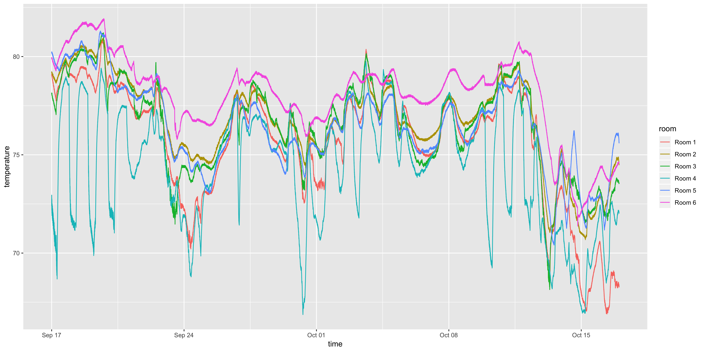

# The Room Temperatures Dataset

To demonstrate how complicated even a simple system with clear causal factors can be, I'm releasing data about the temperature in the rooms of my house. The temperature has been recorded once per minute using a Govee thermometer. The data is found in temperatures.csv, which contains three columns:

1. room: The room in which the temperature was recorded.
2. time: The time in YMD-HMS format at which the temperature was recorded.
3. temperature: The temperature in Fahrenheit.

The dataset contains readings from September 17th, 2018 through October 17th, 2018.

The time series for this dataset is shown below:

There some minor anomalies in the data: about 10 readings are missing for unknown reasons. Because of the high temporal resolution of the data, the missing readings are easily imputed or ignored.
